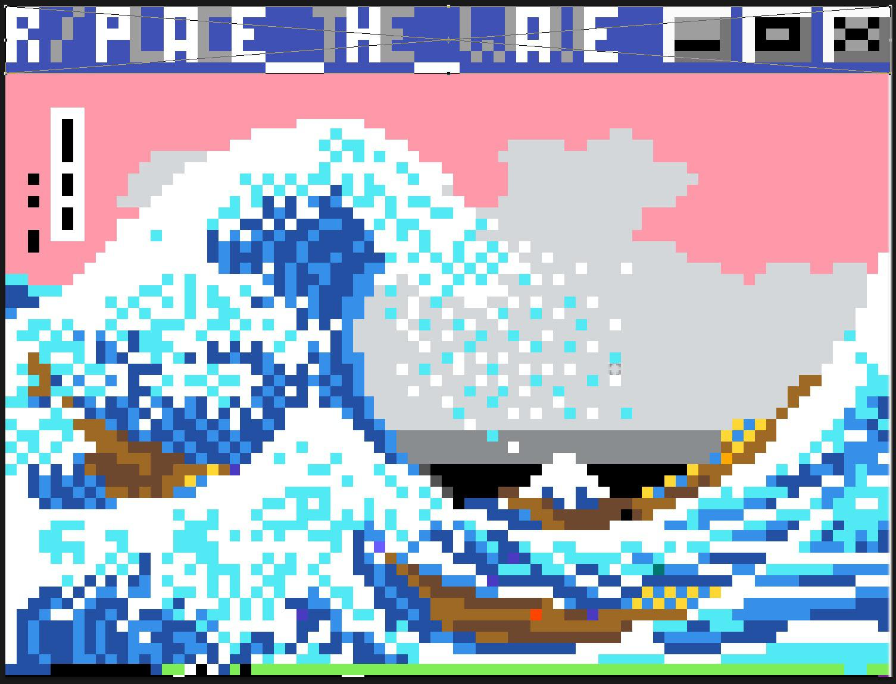

<!-- Animation Typing --> 

 

  

 
 

# 💫 About Me:

### 👋 Welcome to my GitHub Profile
### ⚡ Turning ideas into real applications
### 💻 Software Developer

 

## 🌐 Socials:

# 💻 Tech Stack: 
                      

# 📊 GitHub Stats: 
  <!-- Proudly created with GPRM ( https://gprm.itsvg.in ) -->
